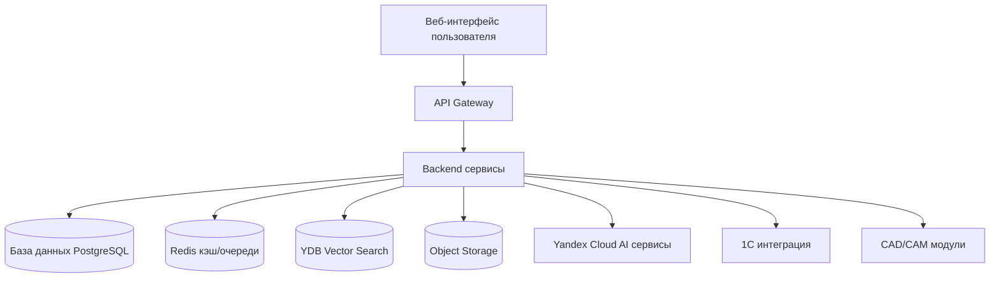
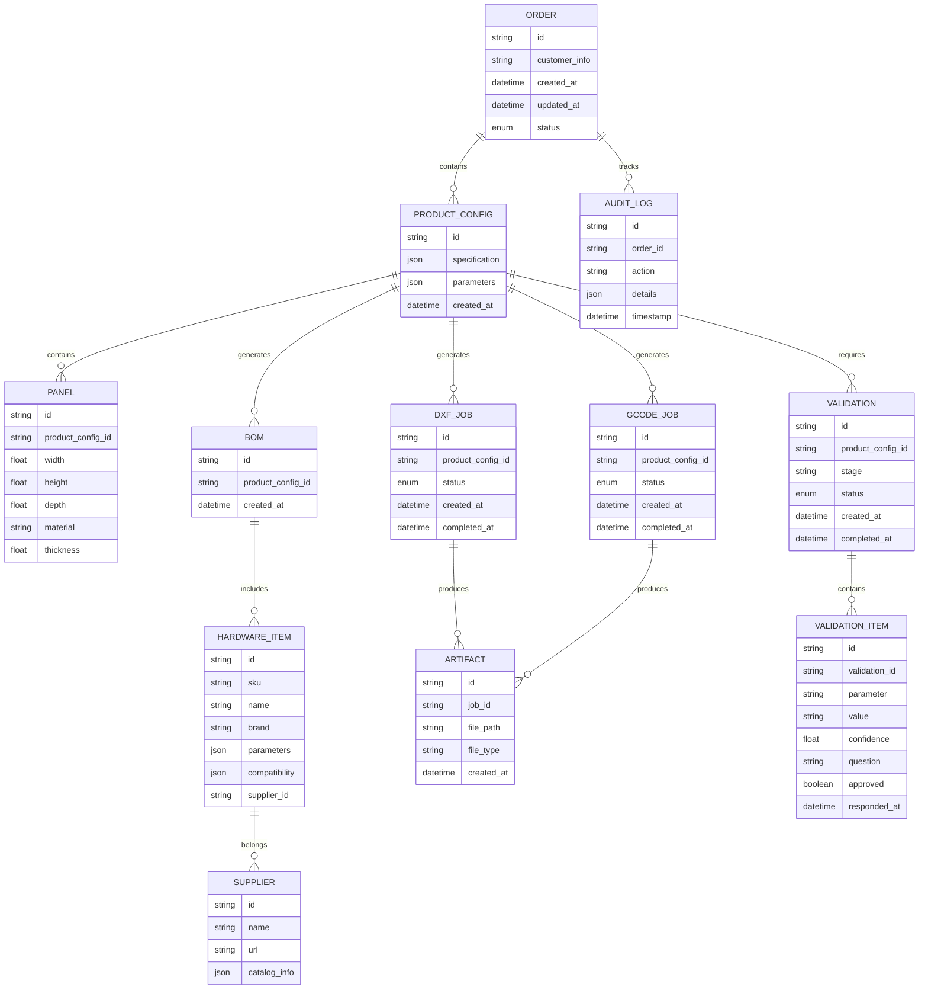
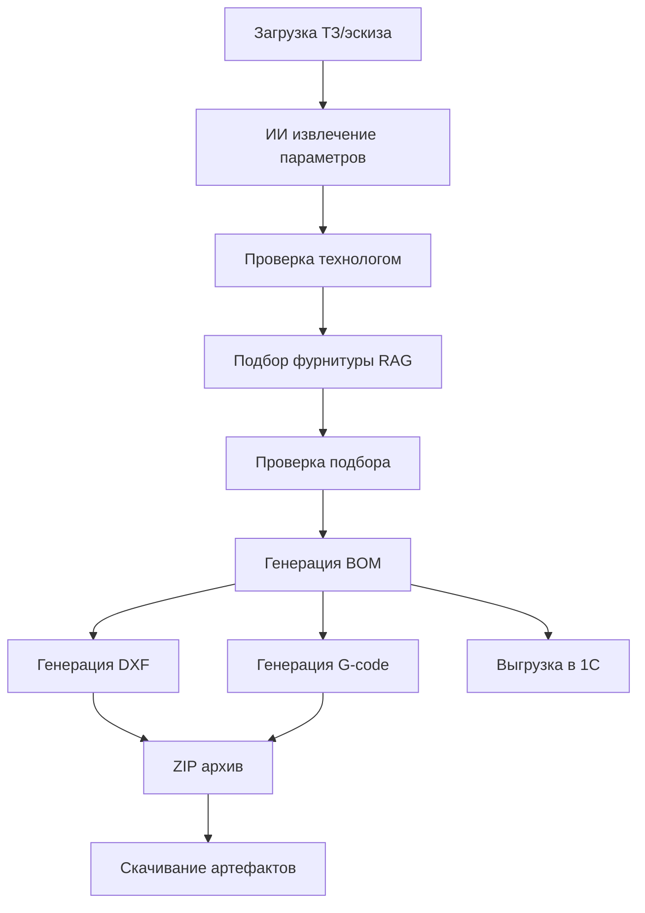
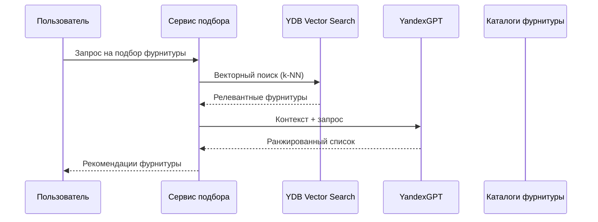
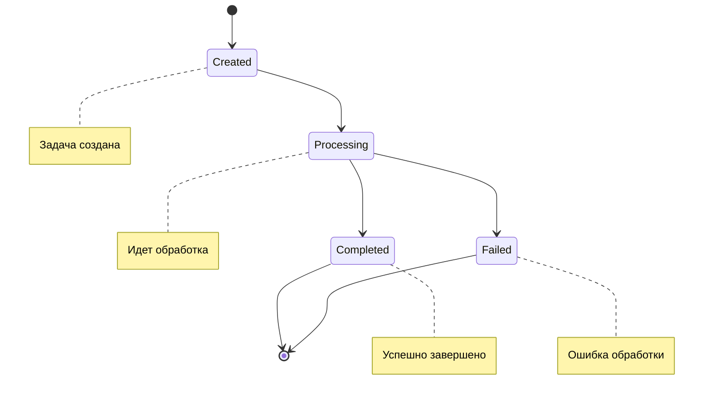

# Дизайн документ для облачного AI-SaaS решения для мебельных фабрик

## 1. Обзор

Облачное AI-решение для мебельных фабрик представляет собой SaaS-платформу, которая автоматизирует процесс от получения технического задания до готовых производственных файлов для станков с ЧПУ. Платформа использует ИИ для извлечения параметров изделий, подбора фурнитуры и генерации производственных файлов.

## 2. Архитектура системы

### 2.1 Общая архитектура



### 2.2 Компоненты системы

1. **Frontend (Next.js 15.5 / React 19)**
   - Интерфейс загрузки ТЗ/эскизов
   - Отображение спецификаций и BOM
   - Интерфейс подбора фурнитуры
   - CAM интерфейс (DXF/G-code)
   - Интеграция с 1С

2. **Backend (FastAPI / Python 3.12)**
   - API для обработки запросов
   - Сервисы для работы с ИИ
   - Очереди задач (Redis)
   - Логика бизнес-процессов

3. **AI/ML компоненты**
   - YandexGPT 5.1 Pro для обработки текста
   - Yandex Vision OCR для работы с изображениями
   - Yandex Embeddings для векторизации
   - YDB Vector Search для поиска фурнитуры

4. **CAD/CAM модули**
   - FreeCAD 1.0.x для генерации G-code
   - ezdxf 1.4.2 для DXF чертежей
   - Shapely 2.x для геометрических операций

5. **Интеграции**
   - 1С:Предприятие 8 (OData/HTTP)
   - Yandex Cloud сервисы

6. **Хранилища данных**
   - PostgreSQL 16 для основных данных
   - Redis 7.2 для кэширования и очередей
   - Yandex Object Storage для файлов
   - YDB для векторного поиска

## 2.3 Актуальность технологий

На момент разработки (сентябрь 2025):
- **FastAPI** поддерживает Python 3.12
- **Next.js 15.5** и **React 19** находятся в стабильном релизе
- **YandexGPT 5.1 Pro** доступен через Yandex Cloud API
- **FreeCAD 1.0.x** может иметь ограничения совместимости с Python 3.12, требуется использовать встроенный Python среды выполнения FreeCAD

## 3. Доменная модель

### 3.1 Основные сущности



## 4. Основные API эндпоинты

### 4.1 Извлечение спецификации
```
POST /api/v1/spec/extract
Content-Type: application/json

{
  "input_type": "text|image|sketch",
  "content": "..."
}

Response:
{
  "product_config_id": "uuid",
  "parameters": {
    "width": 800,
    "height": 600,
    "depth": 400,
    "material": "ЛДСП",
    "thickness": 18
  }
}
```

### 4.2 Подбор фурнитуры
```
POST /api/v1/hardware/select
Content-Type: application/json

{
  "product_config_id": "uuid",
  "criteria": {
    "material": "ЛДСП",
    "thickness": 18
  }
}

Response:
{
  "bom_id": "uuid",
  "items": [
    {
      "hardware_item_id": "uuid",
      "name": "Петля мебельная",
      "quantity": 2,
      "supplier": "Company Name"
    }
  ]
}
```

### 4.3 Генерация CAM файлов
```
POST /api/v1/cam/dxf
Content-Type: application/json

{
  "product_config_id": "uuid"
}

Response:
{
  "dxf_job_id": "uuid",
  "status": "processing"
}

POST /api/v1/cam/gcode
Content-Type: application/json

{
  "product_config_id": "uuid"
}

Response:
{
  "gcode_job_id": "uuid",
  "status": "processing"
}
```


### 4.4 Интерактивная проверка технологом

Система должна реализовать механизм интерактивной проверки на ключевых этапах:

1. После извлечения параметров из ТЗ/эскиза
2. После подбора фурнитуры RAG

На каждом этапе система должна:
- Проверять критические параметры
- Задавать уточняющие вопросы пользователю через веб-интерфейс
- Блокировать переход к следующему этапу до получения подтверждения

Пример API для проверки параметров:

```
POST /api/v1/spec/validate
Content-Type: application/json

{
  "product_config_id": "uuid",
  "stage": "extraction_review",
  "required_approvals": [
    {
      "parameter": "material",
      "value": "ЛДСП",
      "confidence": 0.85,
      "question": "Подтвердите, что материал - ЛДСП?"
    },
    {
      "parameter": "thickness",
      "value": 18,
      "confidence": 0.72,
      "question": "Толщина 18мм. Верно?"
    }
  ]
}

Response:
{
  "validation_required": true,
  "approvals_needed": 2,
  "next_step_allowed": false
}
```

```
POST /api/v1/validation/approve
Content-Type: application/json

{
  "validation_id": "uuid",
  "approvals": [
    {
      "validation_item_id": "item_uuid",
      "approved": true,
      "comment": "Подтверждаю"
    }
  ]
}

Response:
{
  "validation_id": "uuid",
  "status": "completed",
  "next_step_allowed": true
}
```

## 4.5 Интеграция с 1С
```
POST /api/v1/integrations/1c/export
Content-Type: application/json

{
  "order_id": "uuid"
}

Response:
{
  "success": true,
  "1c_order_id": "1c_uuid"
}
```

## 5. Пайплайн обработки



## 6. Процесс подбора фурнитуры (RAG)



## 7. Состояния задач CAM (MVP)



## 8. Безопасность и аудит

### 8.1 Анонимизация персональных данных
- Запрет передачи ПДн в промпты к LLM
- Использование presigned URL с TTL ≤ 15 минут
- Раздельные бакеты для разных типов данных

### 8.2 Роли пользователей
- Администратор
- Технолог
- Дизайнер

### 8.3 Аудит
- Журналы промптов/ответов (без ПДн)
- Источники RAG-поиска
- Логи доступа к файлам

## 9. Метрики и мониторинг

### 9.1 Производительность
- P95 время обработки `/spec/extract` ≤ 5 секунд
- Асинхронная обработка CAM задач

### 9.2 Качество
- Точность извлечения параметров
- Доля ручной правки спецификаций

## 10. Технический стек (MVP)

### 10.1 Backend
- Python 3.12
- FastAPI
- PostgreSQL 16
- Redis 7.2
- Yandex Object Storage

### 10.2 Frontend
- Next.js 15.5
- React 19
- TypeScript

### 10.3 CAD/CAM (MVP)
- FreeCAD 1.0.x (GRBL постпроцессор)
- ezdxf 1.4.2
- Shapely 2.x

### 10.4 AI/ML (MVP)
- YandexGPT 5.1 Pro
- Yandex Vision OCR
- YDB Vector Search
- Yandex Embeddings

### 10.5 Интеграции (MVP)
- 1С:Предприятие 8 (OData/HTTP)

## 10.6 UI/UX Дизайн (MVP)

### 10.6.1 Дизайн-принципы
- Простота и масштабируемость: чёткая иерархия, высокий контраст, минимум скрытых действий
- Современная выразительность: «bento-grid» на дашбордах
- Основа — согласованный стиль интерфейса
- AI-by-default: встроенные ассистенты, «объяснимость» решений

### 10.6.2 Базовый стиль
- Единая цветовая палитра
- Согласованная типографика
- Единообразные элементы интерфейса

### 10.6.3 Компоненты интерфейса
- Buttons, Inputs, Selects, Tabs, Tables
- Cards (bento), Breadcrumbs, Modals/Drawers
- Toasts, Empty States, Upload, Progress, Stepper

### 10.6.4 Переходы
- Базовые переходы между страницами
- Индикация загрузки для LLM/OCR процессов

## 11. Структура проекта

Для организации проекта будет использоваться mono-repo подход:

```
мебель-ИИ/
├── api/                 # Backend сервисы (FastAPI)
├── web/                 # Frontend приложение (Next.js)
├── integrations/        # Модули интеграции (1С, AI сервисы)
├── cad-cam/             # CAD/CAM модули (FreeCAD, ezdxf)
├── shared/              # Общие компоненты и библиотеки
├── tests/               # Тесты всех компонентов
├── docs/                # Документация
├── .gitignore
├── README.md
├── pyproject.toml       # Конфигурация Python проекта
└── docker-compose.yml   # Конфигурация для локального запуска
```

## 12. План разработки MVP (4-6 месяцев)

### Этап 0: Подготовка проекта

#### 1. Создание структуры каталогов

Для создания структуры проекта выполните следующие шаги:

1. Создайте корневой каталог проекта `мебель-ИИ`
2. Внутри корневого каталога создайте следующие подкаталоги:
   - `api/` - для backend сервисов
   - `web/` - для frontend приложения
   - `integrations/` - для модулей интеграции
   - `cad-cam/` - для CAD/CAM модулей
   - `shared/` - для общих компонентов
   - `tests/` - для тестов
   - `docs/` - для документации

Это можно сделать с помощью следующих команд в терминале:

```bash
mkdir мебель-ИИ
cd мебель-ИИ
mkdir api web integrations cad-cam shared tests docs
```

#### 2. Инициализация git репозитория

В корневом каталоге проекта инициализируйте git репозиторий:

```bash
git init
```

#### 3. Настройка линтеров и форматтеров

Для Python (backend):
- Black для форматирования кода
- Ruff для линтинга

Для TypeScript (frontend):
- ESLint для линтинга
- Prettier для форматирования

#### 4. Создание базовой документации

Создайте следующие файлы в корневом каталоге:
- `README.md` - описание проекта
- `CONTRIBUTING.md` - руководство по внесению вклада
- `STYLEGUIDE.md` - руководство по стилю кода

#### 6. Требования к документации кода (MVP)

Код должен содержать понятные комментарии на русском языке:
- Каждая функция/метод должен иметь комментарий с описанием назначения
- Параметры должны быть документированы с указанием типа
- Возвращаемые значения должны быть описаны
- Сложные участки кода должны содержать поясняющие комментарии
- Бизнес-логика должна быть объяснена

#### 7. Настройка CI/CD pipeline

Создайте конфигурацию для CI/CD (например, GitHub Actions) для автоматической проверки кода, запуска тестов и сборки проекта.

### Этап 1: Доменная модель и API

1. Определение сущностей предметной области:
   - `Order` - заказ
   - `ProductConfig` - конфигурация изделия
   - `BOM` - спецификация
   - `Panel` - панель изделия
   - `HardwareItem` - фурнитура
   - `DXFJob` - задача генерации DXF
   - `GCodeJob` - задача генерации G-code
   - `Supplier` - поставщик
   - `AuditLog` - журнал аудита

2. Создание REST API контрактов:
   - `/api/v1/spec/extract` - извлечение параметров из ТЗ
   - `/api/v1/hardware/select` - подбор фурнитуры
   - `/api/v1/cam/dxf` - генерация DXF
   - `/api/v1/cam/gcode` - генерация G-code
   - `/api/v1/integrations/1c/*` - интеграция с 1С

3. Генерация OpenAPI спецификации

4. Создание диаграмм состояний для задач CAM

### Этап 2: Хранилище и инфраструктура

1. Настройка PostgreSQL 16:
   - Создание таблиц для всех сущностей
   - Определение индексов для оптимизации запросов
   - Настройка миграций базы данных

2. Настройка Redis 7.2:
   - Конфигурация очередей задач
   - Настройка механизмов dead-letter

3. Настройка Yandex Object Storage:
   - Создание бакетов `incoming/`, `artifacts/`, `logs/`
   - Настройка прав доступа к бакетам

### Этап 3: Интеграция ИИ (текст и OCR)

1. Подключение Yandex Vision OCR:
   - Интеграция для обработки изображений эскизов
   - Обработка таблиц и печатных форм

2. Подключение YandexGPT 5.1 Pro:
   - Использование для извлечения параметров из текстовых ТЗ
   - Настройка контекста для повышения точности

3. Подключение GigaChat API как резервного провайдера:
   - Реализация fallback механизмов
   - Настройка приоритетов провайдеров

4. Создание клиентов для ИИ сервисов:
   - Реализация retry механизмов
   - Настройка таймаутов
   - Логирование запросов и ответов

5. Реализация интерактивной проверки технологом:
   - Создание механизма задавания уточняющих вопросов
   - Реализация диалога между AI и пользователем
   - Валидация извлеченных параметров профессиональным технологом
   - Блокировка перехода к следующему этапу до получения одобрения

### Этап 4: Векторный слой (RAG на фурнитуре)

1. Создание схемы карточки фурнитуры:
   - `sku` - артикул
   - `brand` - бренд
   - `type` - тип фурнитуры
   - `params` - параметры
   - `compat` - совместимость
   - `url` - ссылка на каталог
   - `version` - версия записи

2. Импорт и нормализация каталогов фурнитуры:
   - Поддержка форматов CSV/XLSX/JSON
   - Валидация и очистка данных
   - Сопоставление параметров разных поставщиков

3. Создание эмбеддингов карточек:
   - Использование Yandex Embeddings
   - Генерация векторных представлений

4. Настройка YDB Vector Search:
   - Создание коллекции для ANN поиска
   - Настройка индексов
   - Реализация k-NN поиска

5. Реализация фильтрации результатов:
   - По материалу и толщине
   - По типу фурнитуры
   - По совместимости

6. Оркестрация RAG пайплайна:
   - Запрос → k-NN поиск → контекст → YandexGPT
   - Ранжирование результатов
   - Формирование рекомендаций

### Этап 5: CAD/CAM (MVP)

1. Генерация DXF файлов:
   - Использование ezdxf 1.4.2
   - Создание чертежей панелей
   - Добавление аннотаций и меток

2. Генерация G-code:
   - Интеграция с FreeCAD 1.0.x Path Workbench
   - Настройка GRBL постпроцессора
   - Генерация кода для станков с ЧПУ

3. Создание ZIP архивов:
   - Упаковка DXF, NC файлов
   - Добавление спецификации и отчетов
   - Метаданные архива

4. Базовые проверки CAM:
   - Проверка размеров (мм)
   - Проверка радиусов

### Этап 6: Фронтенд (Next.js 15.5 / React 19)

1. Создание экранов интерфейса:
   - Экран загрузки ТЗ/эскиза
   - Экран проверки параметров (вопросы технолога)
   - Экран спецификации/BOM
   - Экран проверки подбора фурнитуры
   - Экран CAM (DXF/G-code)
   - Экран интеграции с 1С

2. Реализация маршрутизации:
   - Настройка страниц и навигации
   - Защита маршрутов
   - Обработка ошибок

3. Типизация данных (TypeScript):
   - Интерфейсы для API ответов
   - Типы для сущностей предметной области
   - Валидация данных

4. Современный UI/UX дизайн (MVP):
   - Реализация согласованного стиля интерфейса
   - Использование bento-grid на дашбордах
   - Поддержка светлой темы
   - Базовые анимации и переходы
   - AI-ассистенты с объяснимостью решений
   - Базовый поиск по заказам
   - Интерактивный wizard из 4 шагов (ТЗ→Параметры→BOM→CAM)
   - Компоненты интерфейса
   - Поддержка горячих клавиш
   - Проверка доступности (контраст ≥ 4.5:1, фокус-стили, ARIA)
   - Адаптивный дизайн для настольных браузеров

### Этап 7: Интеграция с 1С

1. Создание коннектора чтения:
   - Получение справочников из 1С
   - Синхронизация данных
   - Обработка конфликтов

2. Создание коннектора записи:
   - Отправка BOM/заказов в 1С
   - Маппинг кодов
   - Обработка ошибок

3. Контракты обмена 1С:
   - URI для обмена данными
   - Форматы полей
   - Обработка ошибок

### Этап 8: Качество (golden set) (MVP)

1. Сбор эталонных кейсов:
   - Подготовка 20-30 тестовых ТЗ
   - Создание эскизов и изображений
   - Формирование эталонных ответов

2. Определение метрик качества:
   - Точность извлечения параметров
   - Доля ручной правки спецификаций

3. Создание регламента валидации:
   - Процедуры ручной проверки
   - Критерии приемки
   - Документирование ошибок

### Этап 9: Безопасность и аудит (MVP)

1. Анонимизация персональных данных:
   - Запрет передачи ПДн в промпты
   - Очистка логов от персональных данных

2. Безопасная работа с файлами:
   - Presigned URL (TTL≤15 мин)
   - Раздельные бакеты для разных типов данных

3. Журналы аудита:
   - Логирование промптов/ответов (без ПДн)
   - Источники RAG-поиска
   - Доступ к файлам

4. Роли пользователей:
   - Администратор
   - Технолог
   - Дизайнер

### Этап 10: Наблюдаемость (MVP)

1. Логирование:
   - Интеграция с YC Cloud Logging
   - Структурированные логи
   - Уровни логирования

2. Метрики:
   - Latency P50/P95
   - Количество ошибок
   - Использование ресурсов

3. Алертинг:
   - Деградация поиска
   - Рост потребления токенов
   - Падение точности

4. SLO/SLA метрики:
   - Определение порогов
   - Мониторинг соответствия
   - Отчеты о доступности

### Этап 11: UAT и релиз

1. Подготовка сценариев приемки:
   - Полный цикл обработки ТЗ
   - Проверка интеграции с 1С
   - Валидация CAM файлов

2. Check-list UX:
   - Обработка ошибок
   - Пустые состояния
   - Удобство интерфейса

3. Документация для пилотов:
   - Руководство пользователя
   - Техническая документация
   - Рекомендации по эксплуатации

4. UAT чек-лист:
   - Шаблон отчета о дефектах
   - Процедура тестирования
   - Критерии приемки

### Этап 12: Пост-MVP бэклог

1. Новые постпроцессоры:
   - Поддержка Fanuc
   - Поддержка WoodWOP

2. Расширение правил фурнитуры:
   - Новые типы совместимости
   - Поддержка аналогов

3. Автоматический нестинг:
   - Оптимизация раскроя материалов
   - Калькуляция себестоимости

4. Ассистенты обучения:
   - Подсказки для технологов
   - Обучение работе с системой
   - Проверка качества

5. Импорт проектов:
   - Поддержка К3
   - Поддержка БАЗИС
   - Поддержка bCAD

6. Мобильная версия:
   - Адаптивный дизайн
   - Офлайн-возможности
   - Мобильные уведомления

7. Расширенная интеграция с ERP:
   - Поддержка Галактика, Парус, 1С:ERP
   - Универсальный адаптер
   - Синхронизация в реальном времени

8. Механизмы обратной связи:
   - Сбор фидбека по ИИ-рекомендациям
   - Коррекция моделей на основе пользовательских данных
   - Система рейтинга рекомендаций

9. Расширенные методы тестирования:
   - Property-based testing
   - Фаззинг-тестирование
   - Chaos engineering
   - Penetration testing

10. Advanced безопасность:
    - Zero Trust Architecture
    - Контроль доступа на основе атрибутов (ABAC)
    - Security scanning в CI/CD pipeline

11. Расширенная наблюдаемость:
    - Distributed tracing
    - Real User Monitoring (RUM)
    - Anomaly detection на основе ML
    - Predictive analytics

## 14. Современные методы проверок (MVP)

### 14.1 Автоматизированное тестирование
- Unit-тесты для всех модулей
- Интеграционные тесты для API endpoints
- E2E тесты для сквозных сценариев

### 14.2 Контроль качества ИИ
- Мониторинг точности извлечения параметров
- Контроль потребления токенов

### 14.3 Мониторинг и алертинг
- Логирование всех пользовательских действий
- Алерты на критические ошибки

## 15. Учет особенностей российского рынка (2025)

### 14.1 Соответствие законодательству
- Соблюдение 152-ФЗ (персональные данные)
- Соблюдение 23-ФЗ (государственная тайна)
- Локализация данных на территории РФ
- Использование сертифицированного ПО

### 14.2 Интеграции с российскими системами
- Поддержка 1С:Предприятие 8
- Интеграция с ГИС МТ (если применимо)
- Поддержка СКБ Контур, Диадок и других ЭДО
- Работа с российскими поставщиками фурнитуры

### 14.3 Локализация
- Поддержка русского языка интерфейса
- Российские форматы дат, валют, номеров
- Учет российских стандартов мебельного производства

## 16. Definition of Done (MVP)

Для завершения MVP должны быть выполнены следующие критерии:

1. Все эндпоинты v1 реализованы и покрыты автотестами
2. Сквозной сценарий «ТЗ/эскиз → BOM → фурнитура (RAG) → DXF/G-code → ZIP → выгрузка в 1С» работает на golden set
3. P95 `/spec/extract` ≤ 5 с; CAM — асинхрон
4. Presigned ссылки и аудит источников включены
5. Документация: OpenAPI, глоссарий, регламенты качества/поддержки

## 17. Потенциальные неопределенности (будут определены в процессе разработки)

Следующие аспекты требуют дополнительного анализа и принятия решений в ходе разработки:

1. **Выбор постпроцессоров для ЧПУ** - определение приоритетности поддержки различных форматов (GRBL, Fanuc, WoodWOP)
2. **Алгоритмы нестинга** - подходы к оптимизации раскроя материалов
3. **Механизмы лицензирования** - как управлять лицензиями коммерческих компонентов (FreeCAD)
4. **Резервное копирование** - политики и стратегии бэкапа данных
5. **Импорт из CAD систем** - приоритетность поддержки К3, БАЗИС, bCAD
6. **Масштабирование** - архитектурные решения для горизонтального масштабирования
7. **Кэширование** - стратегии кэширования результатов ИИ и БД
8. **Управление версиями каталогов** - как отслеживать изменения в каталогах поставщиков

## 18. Функции MVP vs Post-MVP

### 18.1 Функции MVP (4-6 месяцев разработки)

**Ядро пайплайна:**
- Прием ТЗ/эскизов → извлечение параметров (YandexGPT + Vision OCR)
- Интерактивная проверка технологом (подтверждение ключевых параметров)
- Подбор фурнитуры (RAG с Yandex Embeddings + Vector Search)
- Интерактивная проверка подбора фурнитуры
- Генерация BOM
- Создание DXF/G-code файлов (ezdxf + FreeCAD GRBL)
- Упаковка в ZIP и выгрузка в 1С

**Интерфейс:**
- Десктопный веб (Next.js/React)
- Wizard из 4 шагов (ТЗ→Параметры→BOM→CAM)
- Согласованный стиль интерфейса

**Безопасность и аудит:**
- Базовые роли пользователей (админ, технолог, дизайнер)
- Анонимизация персональных данных
- Логирование действий и аудит источников

**Качество:**
- Golden set тесты (20-30 кейсов)
- Метрики качества (точность извлечения)
- Unit + интеграционные + E2E тесты

### 18.2 Функции Post-MVP (после первых 4-6 месяцев)

**Расширенная интерактивная проверка технологом:**
- Интеллектуальный анализ уверенности в параметрах
- Автоматическое определение необходимости проверки
- Расширенный диалог с контекстными подсказками
- История проверок и обоснование решений

**Расширенные CAD/CAM:**
- Поддержка Fanuc, WoodWOP постпроцессоров
- Автоматический нестинг
- Расширенные проверки CAM

**Мобильность:**
- Мобильная версия для технологов на производстве
- Офлайн-возможности
- Мобильные уведомления

**Расширенные интеграции:**
- Поддержка Галактика, Парус, 1С:ERP
- Универсальный адаптер для различных ERP
- RESTful API для интеграции

**Advanced функции:**
- Механизмы обратной связи и коррекции моделей
- Ассистенты обучения и онбординг
- Property-based и chaos testing
- Zero Trust Architecture
- Distributed tracing и anomaly detection
- Расширенная дизайн-система с токенами
- Поддержка темной темы
- Глобальный поиск с AI-подсказками
- Precision@K метрики качества
- Расширенные состояния задач CAM