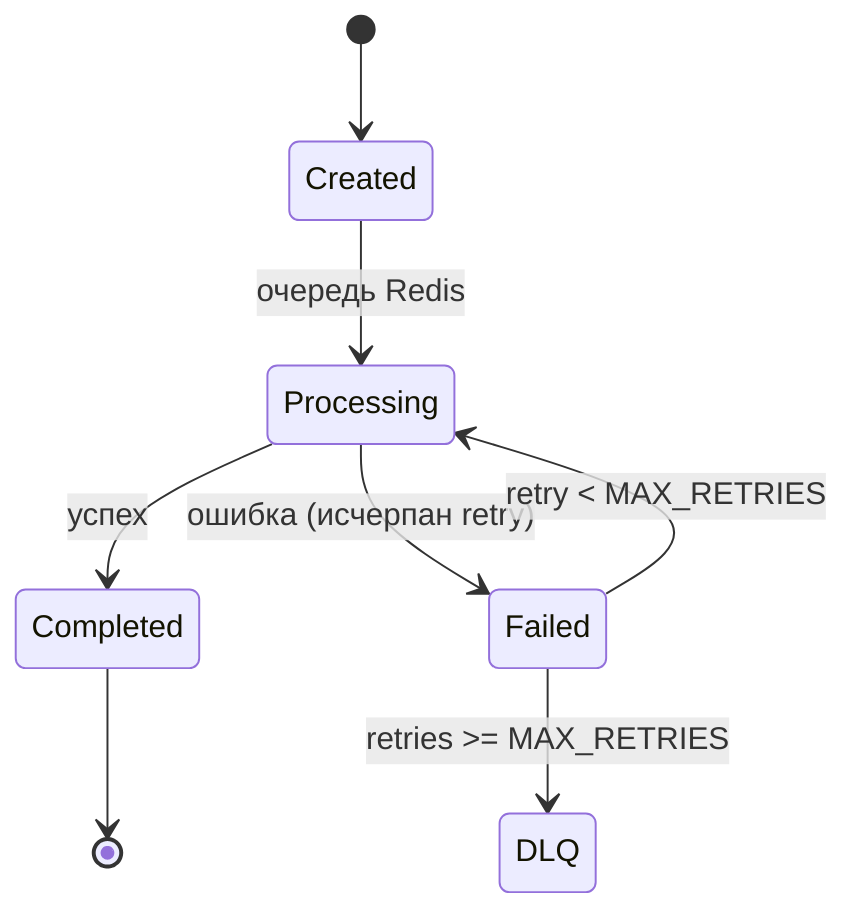

# CAM — состояния задач

Диаграмма состояний для CAM-задач (DXF/G-code). Статусы: Created → Processing → Completed/Failed. Повторы и DLQ предусмотрены.

Примечания
- Очередь: Redis Streams/Lists, отдельные каналы для DXF и G-code.
- Повторы: backoff (например, 2^n секунд), лимит MAX_RETRIES (по умолчанию 3).
- DLQ: отдельный поток для ручного разбирательства.
- Аудит: логируем попытки, тайминги, ошибки, версии инструментов (ezdxf/FreeCAD).
- Единицы измерения — мм; постпроцессор — GRBL по умолчанию.
